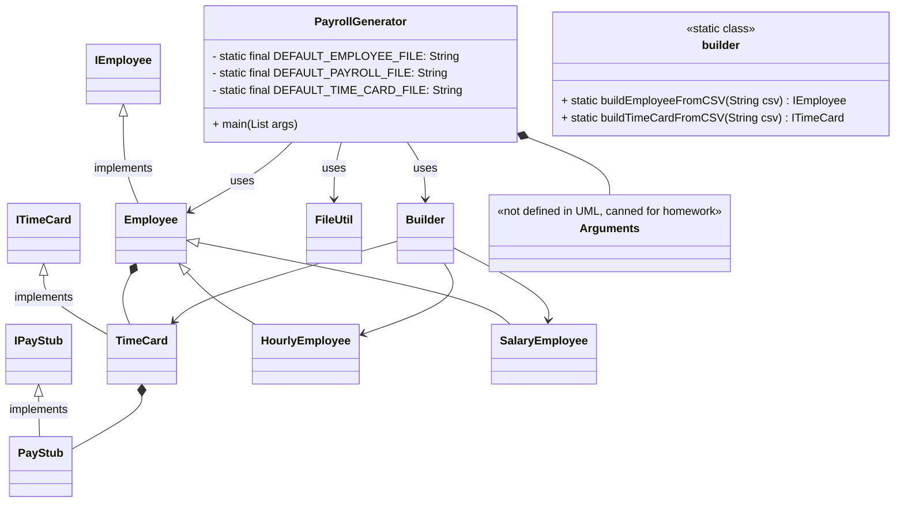

# Payroll Generator Design Document

This document is meant to provide a tool for you to demonstrate the design process. You need to work on this before you code, and after have a finished product. That way you can compare the changes, and changes in design are normal as you work through a project. It is contrary to popular belief, but we are not perfect our first attempt. We need to iterate on our designs to make them better. This document is a tool to help you do that.

If you are using mermaid markup to generate your class diagrams, you may edit this document in the sections below to insert your markup to generate each diagram. Otherwise, you may simply include the images for each diagram requested below in your zipped submission (be sure to name each diagram image clearly in this case!)

## (INITIAL DESIGN): Class Diagram

Include a UML class diagram of your initial design for this assignment. If you are using the mermaid markdown, you may include the code for it here. For a reminder on the mermaid syntax, you may go [here](https://mermaid.js.org/syntax/classDiagram.html)

### Initial Design 

Inputs: 
- employee.csv
- time_cards.csv
- path to output pay_stubs file

Actions: 
- update employee.csv with new payments (pay and taxes)
- create new pay_stubs file

Outputs: 
- updated employee.csv
- new pay_stubs file

TODOs:
- update IPayStub.java (possibly)
- Implement PayrollGenerator.java: main method
- Implement Builder.java: two methods
- Implement ITimeCard.java: two suggested method
- Implement HourlyEmployee class
- Implement SalaryEmployee class

Notes:
- Don't change: IEmployee.java, FileUtil.java, PayrollGenerator.java: Arguments, 

Thoughts: 
- Okay, read in with file util -> create objects from the strings with builder -> combine employee and time card to produce pay stub 
- Whole thing run by payroll generator
- Looks like we will have implementations of epmloyee: hourly and salary

- Do I want to have builder implement IEmployee? No, that's just an interface. It has to implement one of the subclasses
- I think timecards can be defined within the composition of employees.  I don't feel like I want to redefine this for each type of employee and TimeCards really don't need to exist outside of the Employee that owns it.
- I really don't need all these interfaces, but I think I have to keep them for the graders. In the lecture the professor also says that we need to have interfaces for all classes. Seems uncessary when we don't have multiple classes implementing them.

- Key differences of hourly vs salary are in the pay rate, taxes paid, whether hours on pay stub matter.

UML Update
- I don't think that we need to have an abstract class for Employee. Instead, you probably want just the interface for employee and then two types of TimeCards, one for each type of Employee. (It sort of depends on how different the time cards and pay stubs are per employee type)
- No, the above is wrong. Time cards and pay stubs are identical for hourly and salary, all the differences are handled by those classes

## (INITIAL DESIGN): Tests to Write - Brainstorm

Write a test (in english) that you can picture for the class diagram you have created. This is the brainstorming stage in the TDD process. 

> [!TIP]
> As a reminder, this is the TDD process we are following:
> 1. Figure out a number of tests by brainstorming (this step)
> 2. Write **one** test
> 3. Write **just enough** code to make that test pass
> 4. Refactor/update  as you go along
> 5. Repeat steps 2-4 until you have all the tests passing/fully built program

You should feel free to number your brainstorm. 

1. Test that the `Employee` class properly returns `name` from `getName()`
2. Test that the `Employee` class properly returns `id` from `getId()`
3. continue to add your brainstorm here (you don't need to super formal - this is a brainstorm) - yes, you can change the bullets above to something that fits your design.

### Brainstorm
Do I need getters and setters for employee if no other methods need to access its fields?? How about I test a toString() method instead. Seems much more efficient.

Which methods might need to access its fields - well none, it will get the fields from time card and pay stub 

## (FINAL DESIGN): Class Diagram

Go through your completed code, and update your class diagram to reflect the final design. We want both the diagram for your initial and final design, so you may include another image or include the finalized mermaid markup below. It is normal that the two diagrams don't match! Rarely (though possible) is your initial design perfect. 

> [!WARNING]
> If you resubmit your assignment for manual grading, this is a section that often needs updating. You should double check with every resubmit to make sure it is up to date.

## (FINAL DESIGN): Reflection/Retrospective

> [!IMPORTANT]
> The value of reflective writing has been highly researched and documented within computer science, from learning new information to showing higher salaries in the workplace. For this next part, we encourage you to take time, and truly focus on your retrospective.

Take time to reflect on how your design has changed. Write in *prose* (i.e. do not bullet point your answers - it matters in how our brain processes the information). Make sure to include what were some major changes, and why you made them. What did you learn from this process? What would you do differently next time? What was the most challenging part of this process? For most students, it will be a paragraph or two. 
